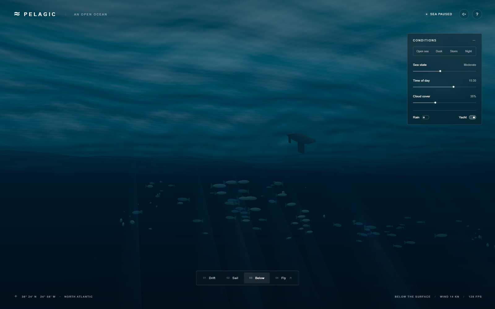
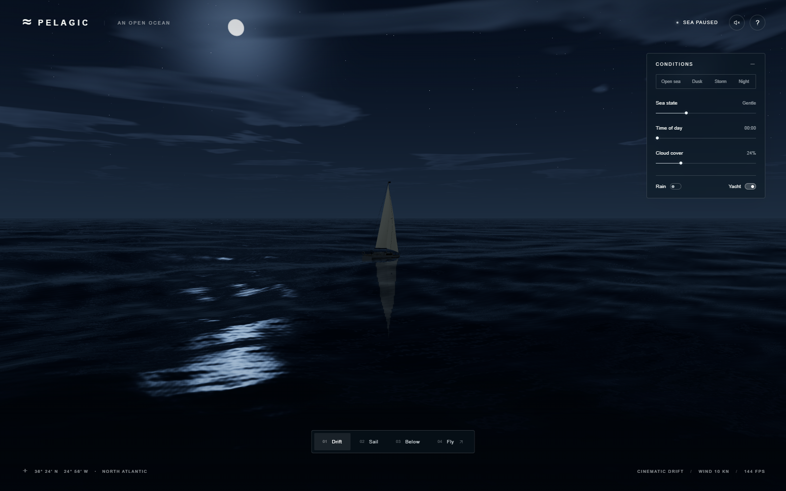

# Development Journey — Ocean 3D / Pelagic

**Date:** 2026-09-30  
**Deliverable:** [Play the ocean](https://az9713.github.io/gpt-6-astra-3D-ocean/) · [Live learning page](https://az9713.github.io/gpt-6-astra-3D-ocean/journey/)  
**Model and effort:** GPT-6 Astra, xhigh, for implementation and the independent automated review.  
**Final render:** [Open sea screenshot](public/media/ocean-open-sea.png)

This is a record of a real build, including the parts that failed. Earlier implementation details are reconstructed from the surviving source, screenshots, interaction results, performance capture, independent review, and session handoff. The later visible-browser troubleshooting and publication work were recorded directly. Some early tool transcripts are unavailable; missing exact error strings, timings, and costs are not invented.

## 1. The brief — make an ocean, then distrust the first picture

The starting folder contained a prompt and a link to [Matt Berman's video at 11:37](https://www.youtube.com/watch?v=T-E7rmD6rh4&t=697s). The user first asked to read the prompt without executing it, then authorized a realistic implementation using GPT-6 Astra at xhigh. A Sonnet 5.5 screenshot supplied a visual target. Later requests added progress images, visible desktop verification, this journey, and public GitHub Pages deployment.

**The original brief, verbatim:**

> Build a real-time 3D ocean in the browser, and keep improving it until still frames could pass for photos of the open sea. Use a real wave simulation with sea states from glassy calm to a storm, whitecaps where waves break, a realistic sky, clouds that shadow the water, times of day through a moonlit night, and rain and lightning. Add a sailing yacht with a wake, and an underwater view with light shafts and fish. Start with a slow cinematic tour, then let me fly around freely, and keep the controls compact and monochrome. Watch out for foam that looks like cotton balls, milky underwater colour, and the splash ripples blowing up when frame times are uneven. Check your work with screenshots and a tough outside reviewer until nothing cheap is left to fix, then tell me plainly how it went.

The [original README.txt](https://github.com/az9713/gpt-6-astra-3D-ocean/blob/main/README.txt) stays unchanged. Its SHA-256 is `EADAEBCFBA9E843EB86B7ADD302B25C375D7190D81FA8C33A3F8F59FFA2F644F`. The supplied prompt is the primary specification; the video is the attributed inspiration, not evidence that every sentence was independently transcribed from it. The video fetch was throttled during publication, so no claim rests on a fresh full viewing.

The ambition was photographic realism. The delivered scene is a procedural approximation that remains visibly CGI. That distinction matters: a working control panel and an attractive screenshot do not prove the hardest part of the brief. There is no supported claim that this beats Sonnet in every respect, and a still reference cannot establish its animation quality or frame rate.

The opening composition favored a low horizon, readable large swells, dark troughs, and a yacht for scale. The controls remain compact and monochrome. The reference analysis called out dense ripples, shallow-looking turquoise, broad white patches, and a large panel. Those observations guided the design; they were not a numerical benchmark.

## 2. Starting from a prompt — and later reconnecting to a real desktop

The local environment was Windows with Node.js 22.22.0 and npm 9.9.4. The implementation used Three.js 0.180.0 and Vite 7.1.7. There was no existing application or Git history in the supplied project folder. The original prompt and unrelated local files had to survive. Building, publishing, and browser control each became authorized at different points; reading a prompt was not treated as permission to run it.

A previously reported Playwright MCP Bridge timeout made the existing Chrome bridge unreliable. The useful alternative was an isolated Playwright CLI Chrome session. It could render the app, click controls, capture actual PNGs, and report console errors without that bridge. That solved browser automation, but it did not prove that the user could see a normal browser window.

The supplied reference attachment could not be materialized on the Windows executor: the transfer helper depended on `os.setxattr`, which Windows Python did not provide. A bounded retry did not solve it. Another participant's actual-pixel analysis was available and used explicitly as secondary evidence. The implementation did not claim to have personally opened unavailable reference bytes. Screenshot uploads later succeeded through the supported direct creation route; transfer metadata limitations were separate from whether the app rendered.

After the user reported that the local Play link showed nothing, a port probe returned HTTP 200 and the original server was still listening on `127.0.0.1:4173`. Restarting the server would have addressed the wrong problem. A new normal Chrome window showed the ocean and yacht. The exact cause of the ChatGPT link-opening failure was not established.

Native Windows screen capture and mouse input then verified the Storm button in that visible window. Foreground restrictions initially produced the exact safety guard error `Ocean 3D is not foreground; no mouse input sent.` Windows display scaling also required DPI-aware capture and coordinates. Corrected focus handling and coordinates produced a visible storm screenshot. A screenshot taken after focus moved to another application was rejected as scene evidence.

The Windows launcher had a separate, concrete weakness: a second invocation tried to start another strict-port server. It now checks for a healthy Ocean 3D response and opens that existing server. The corrected launcher returned exit code 0, and the listening process stayed the same.

> Probe the port before diagnosing a dead server. Capture the screen before claiming the user can see it.

## 3. Design decisions — spend the budget on the horizon

The application uses browser JavaScript, WebGL 2, procedural geometry, and custom GLSL shaders. A shader is a small program that runs on the GPU for vertices or pixels. No external ocean texture pack, cloud model, yacht download, or runtime AI service is required. Procedural construction keeps the initial experience self-contained and avoids asset-loading dependencies; it also exposes the limitations of simple shapes and noise functions.

An analytic Gerstner wave field was chosen instead of a full fluid solver. Each wave has a wavelength, direction, amplitude, steepness, frequency, and phase. The design offers direct art control and bounded evaluation cost. A spectral FFT ocean could represent richer statistical sea states, but it was not implemented. CFD would solve a substantially different, more expensive problem. Here, “simulation” means a moving, physically inspired field, not validated conservation of fluid mass and momentum.

Large displacement and small surface detail are separate. Ten waves shape the silhouette. Six finer waves perturb the shading normal, the direction used for lighting. A nonlinear grid with 380 × 380 segments concentrates geometry near the camera and stretches into the distance. The grid follows the camera; its wave phase uses world coordinates so the sea does not restart underneath it.

The alternative of applying equally strong tiny ripples everywhere would make the horizon shimmer and erase the swell. Detail fades with viewing distance, and displaced waves also fade relative to their wavelength. This is a practical anti-aliasing measure, not a proof that all temporal aliasing is eliminated.

The yacht gives the eye a familiar size cue. A separate reflection render target captures scene objects; the water evaluates sky reflection analytically. This is cheaper than tracing light rays through the whole scene. It cannot reproduce every occlusion, wave-surface reflection, or multiple scattering effect.

The camera begins with a slow tour and hands off to free flight after about 72 seconds. Drift, Sail, Below, and Fly remain available immediately. No navigation mission, score, or boat steering game was added: the requested experience was observation and exploration. Synthesized audio is optional and starts only after a user gesture, as browsers require.

The following pipeline is the practical architecture:

```text
Controls + camera + bounded frame delta
                 |
                 v
        shared scene state / uniforms
          /          |           \
         v           v            v
 GPU wave mesh   atmosphere    CPU wave sampler
 + water shader  + shadows     + yacht buoyancy
         \           |            /
          \          v           /
            Three.js render passes
          reflection target -> canvas
```

`src/main.js` coordinates this loop. `src/ocean.js` owns both the GPU wave definitions and the CPU height sampler. `src/atmosphere.js` shares sky/cloud functions with the ocean shader. `src/yacht.js` builds and orients the boat. `src/objects.js` handles fish, shafts, particles, rain, and lightning. A shared parameter definition prevents independent CPU and GPU oceans from drifting apart.

## 4. The core problem — making independent tricks agree

### Waves: motion is more than raising a plane

For one wave, the phase is `θ = k(d · x) − ωt + φ`. Here `x` is position, `d` is direction, `t` is time, and `φ` is an offset. Wavenumber `k = 2π / wavelength` describes how rapidly the surface changes over distance. Deep-water angular frequency is `ω = √(gk)`, with `g = 9.81 m/s²`. The implementation uses this relation so long swells and short waves do not travel with one arbitrary speed.

The surface height includes `A sin(θ)`. Gerstner displacement also shifts the horizontal position by a cosine term. That pulls the profile toward sharper crests instead of producing a row of equally rounded sine bumps. The renderer differentiates those displacements to find surface tangents, normals, and horizontal compression. Adding directional waves with different wavelengths makes an irregular field without sampling a fluid volume.

Sea state `s`, from 0 to 1, scales wave amplitude by `0.028 + 2.65 × s^1.55`. The superlinear mapping makes high settings rise more dramatically while retaining a little motion at “glassy.” This is an artistic parameter, not a Beaufort calibration or a measured significant wave height.

The live article includes a small cross-section lesson. It isolates the idea of superposition; it does not reproduce the renderer's full displacement or serve as a physical ocean predictor.

<!-- WAVE_LAB -->

| Preset | Sea parameter | Time | Cloud cover | Rain |
| --- | ---: | ---: | ---: | --- |
| Open sea | 0.43 | 15:30 | 35% | Off |
| Dusk | 0.29 | 18:27 | 40% | Off |
| Storm | 0.90 | 14:00 | 98% | On |
| Night | 0.30 | 00:00 | 24% | Off |

A storm changes several mutually reinforcing cues: larger displacement, more broken highlights and whitecaps, dense cloud cover, reduced horizon contrast, rain, and occasional lightning. A taller wave alone looks like a larger calm sea. Weather coherence does more for credibility than merely adding polygons.

### Optics: water is a mirror and a volume

Fresnel reflection means that water reflects more of the sky at grazing angles than when viewed straight down. The shader combines that behavior with deep-water color, approximate absorption, crest transmission, rough sun highlights, and a boat reflection pass. Dark troughs and grazing sky reflection are essential cues to open-sea depth. Adding uniform cyan would instead suggest a shallow lagoon.

The displayed color is also shaped by exposure and ACES filmic tone mapping. Tone mapping compresses bright light into the screen's limited range. This is one reason copying an RGB value from a photograph does not reproduce its material: the lighting and display transform must agree as well.

The sky, water reflections, and cloud shadows share procedural cloud functions and motion. Shared noise alone is insufficient if each system samples different coordinates. A mismatched cloud footprint was corrected during review. Underwater ambient color also needed one consistent model across sky/background and surface shading to avoid a visible horizontal seam.

### Foam: a threshold is an assumption about data

The water computes a compression proxy from the horizontal displacement derivatives. Whitecaps combine that proxy, positive crest position, sea state, and small noise masks. The final compression threshold moves from 0.34 toward 0.19 as sea state increases, with a 0.065 transition band. These are tuned coefficients in this shader, not universal breaking-wave constants.

The first thresholds did not produce the intended foam. A useful lesson is to inspect the actual distribution of the field being thresholded. A plausible-looking number outside its useful range gives either no foam or a white blanket. A live compression histogram would make future calibration easier; that diagnostic has not been built. Thin broken crest marks worked better than unstructured white blobs.

The wake uses the boat's forward direction, distance behind the hull, a V-shaped envelope, and narrow stern turbulence. It is connected to the hull visually. It is not a hydrodynamic wake solver and does not transfer momentum into the main wave spectrum.

### Buoyancy and underwater life: coordinates must mean the same thing

The yacht samples the same wave field as the GPU, including four iterations to invert Gerstner horizontal displacement before looking up a world-space height. Sampling the undisplaced coordinates would put the boat on a neighboring part of the wave. Fore/aft and port/starboard samples set its tilt. This is geometric wave following, not a rigid-body buoyancy simulation with forces, inertia, and sail aerodynamics.

Underwater fish use instanced meshes: the GPU reuses one small geometry at many transforms. There are 96 fish, animated tails, sparse particles, and restrained additive light shafts. Depth attenuation darkens the water. The shafts are geometric effects, not volumetric transport, and the fish do not react as an ecological school. Their silhouettes remain a visible shortcut.

### Stability: avoid a feedback problem you do not need

Click ripples occupy 12 bounded slots. Each impulse has a position, start time, strength, outward-moving front, exponential decay, and a nine-second lifetime. They perturb the shading normal rather than feed energy back into a grid simulation. This removes a common source of splash blow-ups when frame times vary.

The animation loop caps elapsed simulation time at 50 ms per frame; manual QA stepping caps at 100 ms. This is a stability tradeoff: after a long stall, simulated time advances more slowly than wall-clock time. It does not catch up with an unbounded step. Tests included uneven steps and simulation time 100000 seconds, but that is not a guarantee of indefinite floating-point precision.

> Realism comes from agreement between cues. A beautiful reflection cannot rescue a boat floating on the wrong wave.

## 5. Tools, agents, and human decisions

| Tool or role | What it did in this session |
| --- | --- |
| GPT-6 Astra, xhigh implementation agent | Built the procedural scene and iterated on rendering and interaction defects |
| Separate GPT-6 Astra, xhigh review agent | Inspected source and real screenshots; challenged numerical and visual claims |
| Coordinating agent and user | Supplied the brief, reference analysis, visible-browser feedback, publishing direction, and final constraints |
| Three.js 0.180.0 / GLSL / Vite 7.1.7 | Rendered the scene, expressed the shading model, and served/built the app |
| Playwright CLI / Chrome 154 | Clicked controls, sampled animation cadence, checked layouts, and captured actual screenshots |
| Native Windows screen and input APIs | Confirmed the user-visible Chrome window and Storm interaction when a local link appeared to fail |
| Dev Journey skill | Required a reproducible account of failures, omissions, evidence, and costs instead of a victory lap |
| Marked 18.0.14 | Converts this trusted, repository-owned Markdown to a static HTML learning page at build time |
| Git / GitHub CLI / GitHub Actions / Pages | Version control, authenticated repository creation, repeatable builds, and static public hosting |

The independent reviewer was another automated agent, not an outside human or an oceanographer. Its findings mattered: wake numerical failures, inverted motion, underwater seams, cloud alignment, and keyboard behavior were corrected. A second model opinion is useful pressure, but it is not an objective realism certification.

The user supplied explicit implementation approval, chose GPT-6 Astra with xhigh effort, requested screenshot milestones, reported the failed local link, requested computer use, and authorized public publication. Existing GitHub authentication was used; no new credentials were requested or embedded in files. Local restricted-folder operations passed automatic approval review. No exact model token usage, monetary bill, or aggregate session duration was available. No rate-limit reset date or quota expenditure can be stated reliably.

The publication workflow keeps the main experience static. Markdown and screenshots become ordinary HTML and image files. The wave lesson runs locally in the reader's browser. There is no need for a server function, AI key, paid inference endpoint, or remote font.

## 6. What went wrong — and what each fix teaches

### 6.1 Black water behind the yacht

Wake calculations and lighting inputs could enter invalid numerical ranges. The symptom was a black band rather than a clear exception. Denominators and inputs were bounded; the final review checked wake denominators, Fresnel inputs, and bow squaring. This is a useful GPU lesson: a shader can compile and still produce NaNs for particular pixels. Finite-value checks and actual screenshots complement compilation.

### 6.2 Foam that missed the useful range

Initial foam thresholds were ineffective. The correction aligned thresholds and crest masks with the field the shader actually generated. A static threshold should be revisited when amplitude, steepness, noise, or the wave spectrum changes. There is no universal “foam amount” that transfers between implementations.

### 6.3 Yacht and fish orientation

Motion signs did not initially agree with the modeled forward axes. Fixes corrected yacht buoyancy/orientation and fish heading. A model's local positive X or Z axis has to match the direction assumed by its animation. Testing only a front-on screenshot can hide a reversed orientation.

### 6.4 The underwater seam and cloud mismatch

A horizontal color boundary exposed separate underwater color calculations. Another inconsistency made cloud shadows disagree with the sky. Shared ambient calculations and aligned sampling reduced these discontinuities. Coordinates, depth conventions, and units are interfaces just as much as function signatures are.



### 6.5 Spacebar pause and keyboard focus

Keyboard handling needed to distinguish a scene action from a focused control's native action. Review found a pause bug; the final interaction suite verified that Space freezes and resumes simulation time. Camera controls, sliders, buttons, and dialogs must coexist without every key being intercepted globally.

### 6.6 Screenshots that existed but had not reached the user

Rendering and sharing were separate failure surfaces. The app could be running and PNGs could be inspected locally while screenshot transfer remained blocked. The prepared-upload helper was unavailable in the Windows context; the supported direct upload route eventually delivered the images. Public documentation uses curated application captures, not desktop screenshots containing unrelated tabs or session metadata.

### 6.7 A live server did not mean an opened browser

The user clicked a local link and saw nothing. HTTP 200 disproved the dead-server assumption. Opening Chrome directly solved the visible-launch requirement. Focus and display scaling then complicated mouse verification. The guard message `Ocean 3D is not foreground; no mouse input sent.` was a refusal to click the wrong window, not a failed ocean render. No unrelated browser work was closed.

### 6.8 Documentation and build friction

During publication, an attempted patch that deleted and added the same README in one operation was rejected: `invalid patch: multiple operations target` followed by the local README path. The file was then written with a correctly quoted UTF-8 write. A first license lookup expected `LICENSE.md` for Marked; the installed package used a different filename. These were authoring errors, not application failures. The lockfile and actual installed package were treated as evidence rather than guessing filenames.

A first preview navigation returned `net::ERR_CONNECTION_REFUSED`; a process launch had been mistaken for a ready server. The check was changed to probe HTTP readiness. The Playwright CLI sandbox also raised `ReferenceError: URL is not defined` for a helper available in many other JavaScript environments; simple path joining removed that assumption. Finally, putting a nested HTML page under the static public folder let the development server fall back to the ocean app instead of the article. Registering the journey as a real second Vite HTML entry made development and production routing agree.

The initial publication smoke test found a missing article favicon and sampled the underwater camera transition too early. An explicit favicon and waiting for the actual underwater state corrected those checks. Visual inspection then exposed a relative screenshot hyperlink that needed the same path rewrite as inline images. The release checklist now exercises that link too. A whitespace check flagged intentional Markdown line breaks and inherited license formatting; those were reviewed rather than rewriting the original prompt.

GitHub's first dependency scan then reported six Vite development-server advisories in the original 7.1.7 toolchain, including Windows file-access and UNC-path handling issues. The static hosted ocean does not run Vite, but local development still deserves a maintained toolchain. Publication therefore updated Vite to the fixed 7.3.5 release within the same major version. This is a different concern from shader correctness: a beautiful frame says nothing about the security of the tool serving it.

### 6.9 Unknown unknowns worth watching

| Surprise | Why it happens | Mitigation here and the remaining gap |
| --- | --- | --- |
| A still looks good; motion sparkles | Fine waves become smaller than a pixel or change too fast between frames | Distance filtering reduces detail; temporal aliasing still needs cross-device video review |
| A calm-to-storm slider destabilizes a boat | Height, horizontal displacement, and CPU sampling no longer agree | Shared wave definitions and inverse sampling; no physical capsize or full buoyancy model |
| A shader compiles but a patch turns black | Division, exponentiation, or normalization enters an invalid range | Bounded inputs and reviewed wake formulas; compilation alone is insufficient |
| “More foam” becomes a white carpet | Thresholds assume the wrong compression distribution | Tuned crest/compression masks; a histogram/debug overlay is a future improvement |
| A camera-centered world shows seams | Local coordinates are used where world coordinates were needed | World-space phases and shared functions; very long-distance floating-origin precision remains untested |
| A high-DPI laptop is much slower | Pixel cost grows with DPR squared; 1.5 DPR means 2.25 times the pixels | DPR capped at 1.5; no adaptive resolution or broad mobile thermal testing |
| Headless FPS overpromises | Display refresh, browser throttling, GPU scheduling, and visibility differ | Label headless numbers; actual visible launch verified; no sustained visible benchmark yet |
| A phone layout fits but is not fully playable | Responsive CSS does not supply keyboard-equivalent touch movement | Presets and cameras are usable; full touch flight and phone performance remain open |
| It works locally but deploys blank | A project site lives below a repository path; root-relative assets point elsewhere | Relative Vite base and deployed asset checks; custom domain changes need another check |
| Opening HTML from disk fails | ES module loading and browser origin rules differ from HTTP hosting | Use Vite or Pages; do not disable browser security or rely on file URLs |
| Audio appears broken | Browsers prevent autoplay before a gesture | Explicit sound button; no autoplay promise |
| Source is public but reuse terms are unclear | Publishing and licensing are separate choices | Preserve dependency notices; project-wide license selection remains open |
| A repeated build looks slightly different | Timing, viewport, shader precision, and GPU implementation change the frame | Fixed QA scene settings and lockfile; bit-identical cross-GPU screenshots are not promised |

## 7. Verification — separate observation from inference

The local browser suite passed 27 checks: presets, slider extremes, time/cloud changes, switches, panel collapse, help, audio enable/mute, free-flight movement, pause/resume, underwater entry, the 72-second tour handoff, uneven time steps, finite long-time state, and three viewport layouts. The tested viewports were 1152 × 720, 844 × 390, and 390 × 844. A layout fit is not a physical-phone performance test.

The production build passed and its output was served on a separate local port. The production app loaded, Storm worked, and no browser errors were observed in that smoke test. Final local interaction review reported zero console errors and warnings. Eight final scene modes had actual screenshots inspected. The independent review reported no remaining execution blocker while explicitly rejecting photographic-realism claims.

### What the performance number actually means

The sustained sample ran Storm with cinematic camera, yacht, rain, and natural lightning for **45.006 seconds / 5257 frames** after a two-second warmup. Hardware was an NVIDIA GeForce RTX 3050 Laptop GPU via ANGLE Direct3D11; browser was Headless Chrome 154 on Windows; viewport/render size was 1600 × 1000 at DPR 1.

| Metric | Result |
| --- | ---: |
| Average requestAnimationFrame cadence | 116.81 FPS |
| Slowest one-second interval | 108.26 FPS |
| Median frame interval | 7.0 ms |
| p95 / p99 interval | 14.0 / 14.1 ms |
| Maximum interval | 14.6 ms |
| Frames longer than 33.34 ms | 0 |

The slowest one-second interval is **not** a statistical “1% low.” Cadence is not GPU render time. Constant renderer geometry/texture counts over 45 seconds do not prove the absence of memory leaks over hours. Separate three-second mode measurements were only spot checks. A visible Chrome storm screenshot later showed 53 FPS on the HUD and the opening showed 60 FPS. Those are brief observations under different conditions, not a controlled headless-versus-visible experiment.



### Publication checks

The repository uses relative Vite asset paths so the same build works below `/gpt-6-astra-3D-ocean/`. GitHub Actions installs the exact lockfile, regenerates the journey, builds Vite output, and deploys that artifact to Pages. The live game and journey must be checked after deployment: a green workflow is evidence of a deployed artifact, not proof of correct links, shader rendering, or input behavior. Publication findings are recorded in [the verification guide](https://github.com/az9713/gpt-6-astra-3D-ocean/blob/main/docs/VERIFICATION.md).

The first public deployment passed 16 browser checks against the actual Pages URLs. Both pages returned HTTP 200. Storm, Below, Night, and free flight responded; scripts and styles loaded under the repository subpath; the article's slider and animation button worked; its images loaded; its 390-pixel layout had no document overflow; and Play returned to the game. No browser errors or failed assets were recorded. Actual deployed game, article, lesson, and mobile screenshots were inspected. The tested revision is recorded with the verification evidence.

The final saved browser run passed **17 checks** at `2026-09-30T16:55:09.555Z`, adding the corrected screenshot-link check. It tested revision `cdc79f8`, after the Vite update. The subsequent `775fbd4` commit changed only the original prompt's line endings; it was deployed and HTTP-checked, but was not itself the target of that 17-check run. The [verification record](https://github.com/az9713/gpt-6-astra-3D-ocean/blob/main/docs/deployment-verification.json) retains both results and their full tested revision identifiers. An evidence-documentation commit must not silently relabel an earlier test as a new one.

The [Vite deployment guide](https://vite.dev/guide/static-deploy.html#github-pages) documents why a repository site needs appropriate asset bases. The project uses a relative base to support both local and repository subpath hosting. No security settings or browser cross-origin protections were disabled.

## 8. Where things stand — a playable lesson, with visible limits

[Play Ocean 3D](https://az9713.github.io/gpt-6-astra-3D-ocean/) or [open the repository](https://github.com/az9713/gpt-6-astra-3D-ocean). The README puts Play and this journey first, followed by a clickable screenshot. GitHub cannot execute JavaScript inside a README; one click to a static hosted game is the practical low-friction route. The journey has no required install or external fonts.

The source, lockfile, original prompt, screenshots, Markdown journey, generated HTML, public test summaries, and deployment workflow are durable project artifacts. Private attachments, local logs, account details, machine paths, and unrelated desktop captures are excluded. The app works without a runtime key or service. No project-wide license has yet been selected; dependency notices do not silently license the original project or the video.

The remaining realism work is concrete: richer volumetric clouds, less regular specular response, better fish and shaft geometry, a statistically richer wave spectrum, and physically integrated yacht motion. The remaining product work includes sustained visible-browser and mobile thermal measurements, broader browser testing, keyboard-equivalent touch flight, adaptive resolution, and a reduced-motion experience for the main scene. The demo stands without those improvements, but it is not a completed photoreal ocean research renderer.

For a learning exercise, change one cue at a time. Remove distance fading and look for shimmering at the horizon. Change the foam threshold and observe where it saturates. Compare an uncorrected height sample with the inverse world-space sampler. Then restore the change and record the difference. These experiments teach more than simply increasing a “realism” slider.

> Ship the evidence with the claim. Keep the illusion enjoyable, and keep the explanation honest.
