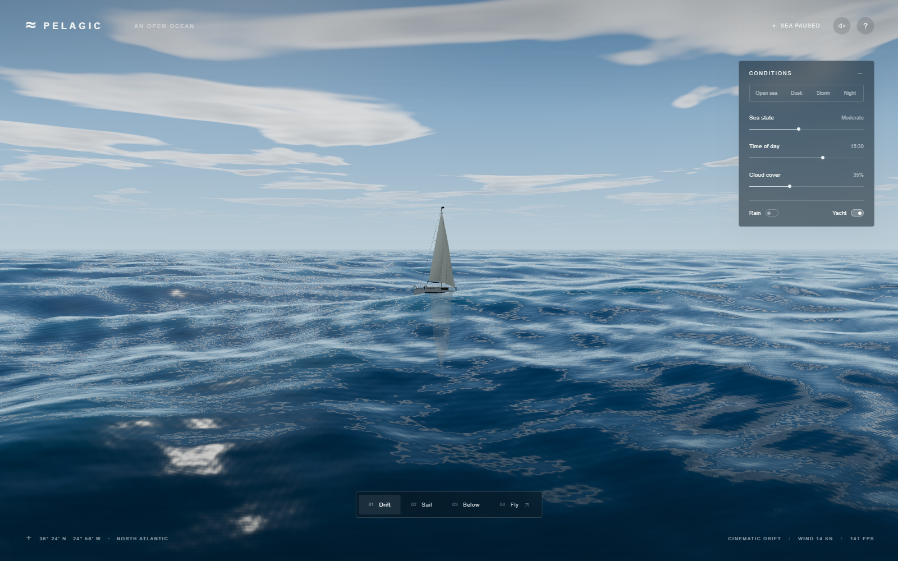
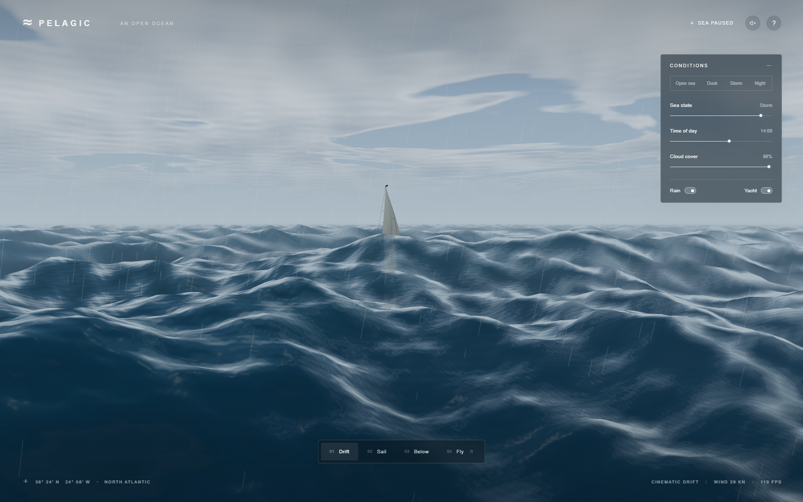

# Ocean 3D · Pelagic

### [▶ Play Ocean 3D](https://az9713.github.io/gpt-6-astra-3D-ocean/) · [Read the Development Journey](https://az9713.github.io/gpt-6-astra-3D-ocean/journey/)

An open ocean you can explore in your browser: long swells, changing weather, a sailing yacht, moonlight, and life below the surface. Built with **GPT-6 Astra at xhigh reasoning effort**, Three.js, and custom shaders.

[](https://az9713.github.io/gpt-6-astra-3D-ocean/)

**Click the image or Play link to begin.** No install, sign-in, or API key. GitHub READMEs cannot execute an interactive JavaScript game, so this opens the playable GitHub Pages version in one click. It is an exploration sandbox; there is no score or win condition. Desktop Chrome or Edge with WebGL 2 is the tested path.

## Explore in a minute

1. Watch the slow opening tour, or choose **Sail** to follow the yacht.
2. Open **Settings**, then move **Sea state** from glassy calm to storm. Try **Dusk**, **Night**, and **Storm**.
3. Choose **Below** for fish and underwater light. Choose **Fly**, drag to look, and use **WASD** to move.

| Control | What it does |
| --- | --- |
| Drift / Sail / Below / Fly | Change camera mode at any time |
| WASD · Q / E · Shift | Move · descend / ascend · move faster in Fly |
| Drag · mouse wheel | Look around · adjust flying speed |
| F · Esc · Space · H | Fly · return to Drift · pause · keyboard guide |
| Click water | Add a small, fading surface ripple |
| Settings · speaker · logo | Open/close controls · enable sound · reset scene |

On phones and short windows, **Settings** starts collapsed. Tap it to open the controls; tap again, tap outside, or press **Esc** to close. The panel scrolls on short screens, keeps its heading visible, and preserves your conditions when closed. Desktop controls start expanded. Mobile Settings targets are at least 44 CSS pixels.

The opening tour hands off to free flight after about 72 seconds. Sound starts only after a click. [Mobile control checks](docs/CONTROLS.md) use desktop-browser viewport and touch emulation; physical-phone performance and a complete touch flight control scheme are not validated. Keyboard flight is best on desktop. Storm mode includes lightning flashes.

## Learn how the illusion works

The [illustrated development journey](https://az9713.github.io/gpt-6-astra-3D-ocean/journey/) includes an interactive wave lesson, the actual architecture, bugs and fixes, measured performance, and surprises that appear when procedural art becomes a shipped web app. Its [Markdown source](DEVELOPMENT-JOURNEY.md) is also in this repository.

| What you see | How it is made |
| --- | --- |
| Calm water through large swells | Ten directional Gerstner waves with deep-water dispersion; sea state scales amplitude |
| Nearby ripples and a quiet horizon | Six extra normal-detail waves with distance filtering |
| Blue depth, sky reflections, bright crests | Fresnel reflection, artistic absorption/transmission, rough sun glints |
| Breaking foam and a connected wake | Crest/compression masks, procedural breakup, and a hull-aligned wake |
| Clouds, shadows, sun, moon, rain | Shared procedural atmosphere functions and local weather geometry |
| Yacht and underwater life | Procedural meshes, wave-following buoyancy, instanced fish, shafts and particles |



These are actual browser screenshots, not generated concept art. The result is **visibly CGI**. Clouds can look like sheets, highlights can look regular or metallic, fish are simple, and yacht motion is approximate. This is not CFD, marine forecasting, or a validated full fluid solver. Photographic realism was the aspiration; it was not established, and there is no proven win over the Sonnet reference.

## Origin: Matt Berman's video and the prompt

Inspired by [Matt Berman's video at 11:37](https://www.youtube.com/watch?v=T-E7rmD6rh4&t=697s) and the ocean challenge supplied with it. The following is the **complete original README.txt content**, preserved verbatim. Attribution identifies the source supplied for this project; this is an independent implementation, not an endorsement or a copy of another model's code.

```text
https://www.youtube.com/watch?v=T-E7rmD6rh4&t=697s

Build a real-time 3D ocean in the browser, and keep improving it until still frames could pass for photos of the open sea. Use a real wave simulation with sea states from glassy calm to a storm, whitecaps where waves break, a realistic sky, clouds that shadow the water, times of day through a moonlit night, and rain and lightning. Add a sailing yacht with a wake, and an underwater view with light shafts and fish. Start with a slow cinematic tour, then let me fly around freely, and keep the controls compact and monochrome. Watch out for foam that looks like cotton balls, milky underwater colour, and the splash ripples blowing up when frame times are uneven. Check your work with screenshots and a tough outside reviewer until nothing cheap is left to fix, then tell me plainly how it went.
```

[Original prompt file](README.txt) · [Development journey](https://az9713.github.io/gpt-6-astra-3D-ocean/journey/) · [Verification and limitations](docs/VERIFICATION.md)

## Run or change it locally

Use **Node.js 22.22.0** to match the published build, then:

```sh
git clone https://github.com/az9713/gpt-6-astra-3D-ocean.git
cd gpt-6-astra-3D-ocean
npm ci
npm run dev
```

Open `http://127.0.0.1:4173/`. On Windows, **Launch Ocean 3D.bat** installs dependencies if needed, opens the browser, and reuses an already-running Ocean 3D server. Closing a newly started server terminal stops that local server; the hosted version does not depend on it. Do not open `index.html` as a `file://` URL: ES modules need an HTTP server.

```sh
npm run build                 # regenerate the journey and build everything
npm run preview -- --port 4174
```

The production preview uses a second port so it can coexist with development. Dependencies are locked in `package-lock.json`. The published game runs entirely in the browser; its app code makes no analytics, AI, or external asset requests. GitHub serves the static files and has its own hosting policies.

## Source map

| File | Responsibility |
| --- | --- |
| `src/main.js` | Renderer, camera, UI, reflection pass, audio, review API |
| `src/ocean.js` | Wave spectrum, CPU buoyancy sampler, water shaders |
| `src/atmosphere.js` | Sky, clouds, solar lighting and shared GLSL |
| `src/yacht.js` | Yacht model and wave-following orientation |
| `src/objects.js` | Fish, light shafts, particles, rain and lightning |
| `DEVELOPMENT-JOURNEY.md` | Authoritative learning article |
| `scripts/build-journey.mjs` | Builds the static HTML journey with its wave lesson |
| `journey/` · `public/media/` | Generated learning page and actual screenshots |
| `.github/workflows/pages.yml` | Reproducible GitHub Pages build and deployment |

The review hook `window.oceanQA` supports scene presets, camera placement, bounded stepping, ripples, lightning, and diagnostics. See [the verification guide](docs/VERIFICATION.md) for examples and a reproducible browser smoke test.

## Evidence, costs, and reuse

The local build passed **27 interaction checks** and an independent automated code/visual review by a separate **GPT-6 Astra agent at xhigh**. A 45-second **headless** storm sample on an RTX 3050 Laptop GPU at 1600 × 1000, DPR 1 averaged **116.81 FPS** (p95 frame interval 14.0 ms). A later normal-browser screenshot displayed 53 FPS during storm; that is a brief HUD observation, not a sustained benchmark or a controlled comparison. See the [full caveats](docs/VERIFICATION.md).

No exact AI token bill or end-to-end cost was available. Visitors need no paid AI service. Public visibility does not itself grant a software license: no project-wide reuse license has been selected. Dependency terms are recorded in [THIRD_PARTY_NOTICES.md](THIRD_PARTY_NOTICES.md); the video and original challenge remain attributed to their source.
