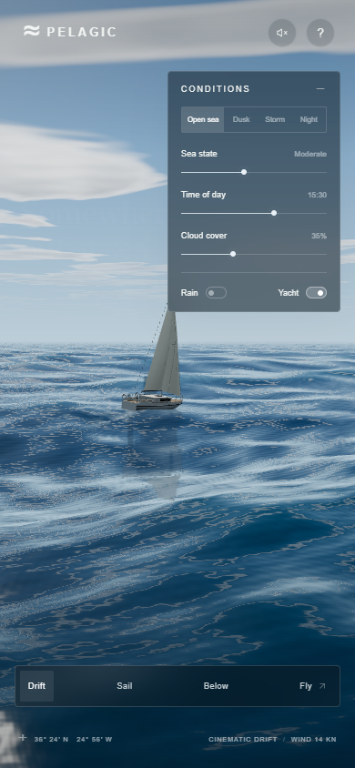
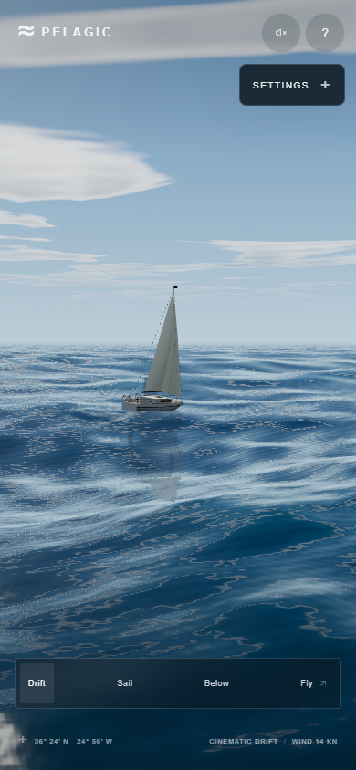

# Compact ocean controls

Settings starts collapsed at widths up to 700 CSS pixels or heights up to 560 CSS pixels. The compact button occupies 116 x 46 pixels including its border. Larger desktop windows keep the existing expanded, 242-pixel-wide panel.

Open Settings for the same presets, sea state, time, cloud cover, rain, and yacht controls. Tap the heading again or outside the compact panel to close it. Escape closes an open compact panel and returns keyboard focus to Settings. On desktop, Escape still returns to Drift when focus is outside Settings. Conditions survive closing, and each layout remembers its open/closed preference for the current page session.

Compact controls provide at least 44 x 44 CSS-pixel targets, larger slider thumbs, visible keyboard focus, and native range keyboard support. Hidden controls leave the tab order. The panel scrolls internally while its heading remains visible. Safe-area insets and dynamic viewport units reserve space for the browser, cutouts, and the camera bar.

## Actual browser captures

All images show only the project viewport. The before capture is revision `753da81c692a1053e740b15ac1a0322c3ed7d60f`; after captures show the locally tested controls working tree identified in the evidence file. The same paused scene was used for comparison.

| Before, 390 x 844 | After, initially collapsed |
| --- | --- |
|  |  |

[Expanded portrait controls](screenshots/controls-after-portrait-expanded.png) · [Expanded landscape controls](screenshots/controls-after-landscape-expanded.png)

## Verification and limits

The saved [local results](controls-verification.json) record 73 passing checks, zero failures, the actual timestamp, browser, and tested source blob identifiers. Tested viewports: 390 x 844, 320 x 568, 844 x 390, 667 x 375, 568 x 320, and 700 x 500; desktop regression checks use 1440 x 900. The initial test found camera-bar overlaps at two short landscape sizes; those were corrected before the saved passing run.

Checks cover initial disclosure state, dimensions, reachable controls, scrolling, presets, sliders, switches, keyboard navigation and focus, Escape behavior, resizing, trusted Chromium touch events, native touch-slider dragging, the help dialog, finite WebGL state, and browser/network errors. The tests inspect actual controls in a rendered browser. They do not measure mobile frame rate or establish physical-device compatibility. Notched-device insets, iOS Safari behavior, physical touch ergonomics, and thermal performance still need real-device testing.

Run the repeatable controls suite with Playwright CLI after opening the app locally or at its deployed URL:

```powershell
playwright-cli -s=controls-review open https://az9713.github.io/gpt-6-astra-3D-ocean/ --browser chrome
playwright-cli -s=controls-review run-code (Get-Content scripts/controls-smoke.js -Raw)
```

`npm run build` also rebuilds the learning page. The original deployment results in `deployment-verification.json` remain historical evidence, separate from this controls update. A commit storing evidence is not automatically the revision tested by an earlier run; source blob identifiers describe this local run without implying an untested commit was verified.
